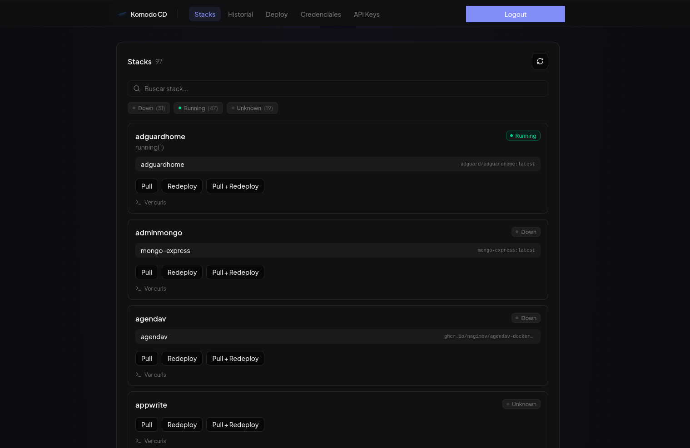
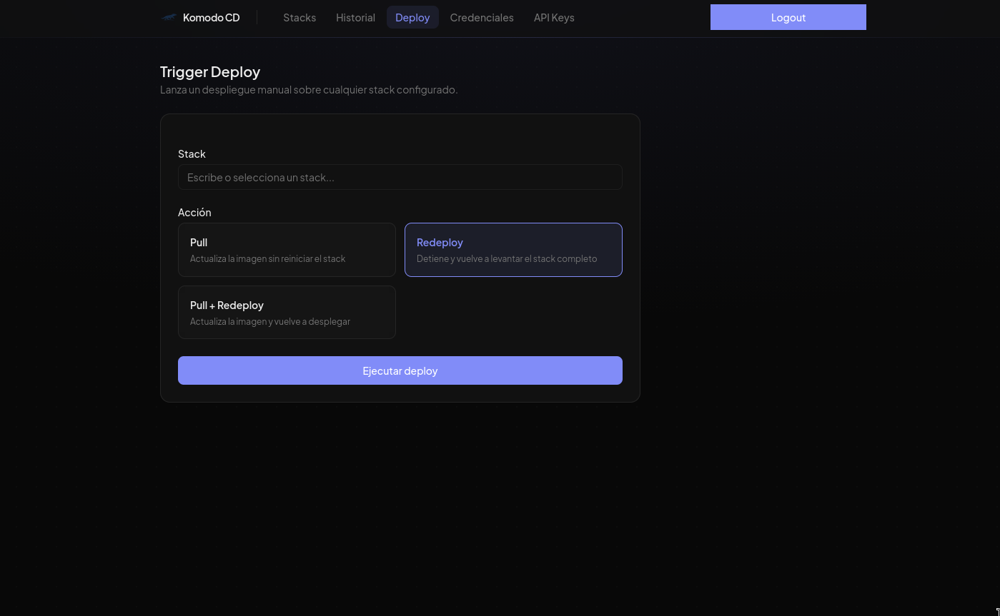
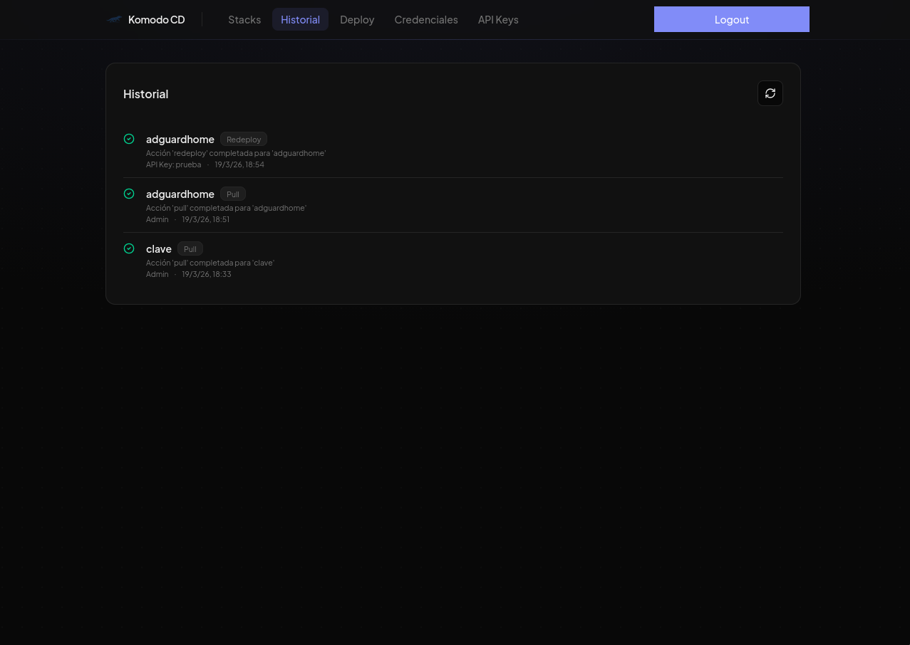
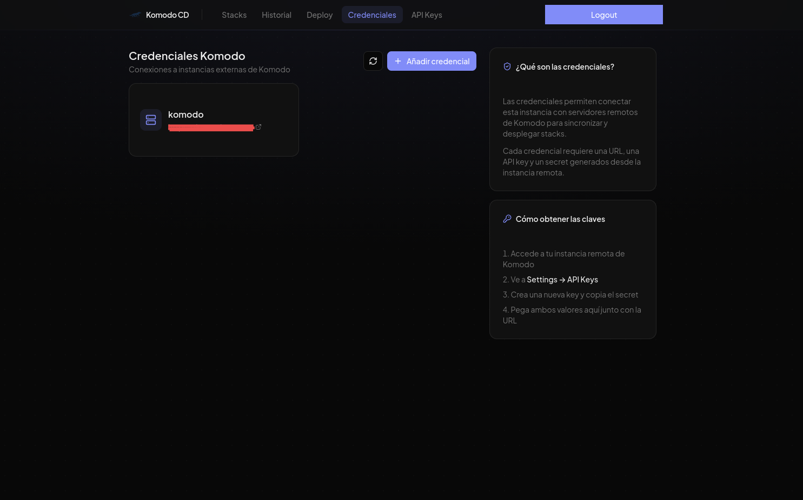

# Komodo CD — Docker

Production deployment for Komodo CD using images published on GHCR.

|              | Repository                                                                  |
| ------------ | --------------------------------------------------------------------------- |
| **Backend**  | [Nonetss/komodo-cd-backend](https://github.com/Nonetss/komodo-cd-backend)   |
| **Frontend** | [Nonetss/komodo-cd-frontend](https://github.com/Nonetss/komodo-cd-frontend) |

| Stacks                    | Deploy                    |
| ------------------------- | ------------------------- |
|  |  |

| History                       | Credentials                          |
| ----------------------------- | ------------------------------------ |
|  |  |

## Requirements

- Docker + Docker Compose v2
- Internet access to pull images

## Quick start

### 1. Generate secrets

```bash
# Better Auth secret (required)
openssl rand -base64 32

# Initial admin password (required)
openssl rand -base64 16
```

### 2. Configure environment

```bash
cp .env.example .env
```

Edit `.env` and fill at least these three variables:

```env
APP_URL=https://your-domain.com
BETTER_AUTH_SECRET=<output of first openssl command>
SEED_ADMIN_PASSWORD=<output of second openssl command>
```

### 3. Start

```bash
docker compose up -d
```

The app will be available on the port configured in `PORT` (default `80`).

---

## compose.yml

```yaml
services:
  backend:
    image: ghcr.io/nonetss/komodo-cd-backend:latest
    restart: unless-stopped
    volumes:
      - db_data:/data
    environment:
      DATABASE_URL: "file:/data/db.sqlite"
      BETTER_AUTH_URL: "${APP_URL:?APP_URL is required}"
      BETTER_AUTH_SECRET: "${BETTER_AUTH_SECRET:?BETTER_AUTH_SECRET is required}"
      SEED_ADMIN_EMAIL: "${SEED_ADMIN_EMAIL:-admin@example.com}"
      SEED_ADMIN_NAME: "${SEED_ADMIN_NAME:-Admin}"
      SEED_ADMIN_PASSWORD: "${SEED_ADMIN_PASSWORD:?SEED_ADMIN_PASSWORD is required}"
    networks:
      - komodo_net

  frontend:
    image: ghcr.io/nonetss/komodo-cd-frontend:latest
    restart: unless-stopped
    environment:
      BACKEND_URL: "http://backend:3000"
    ports:
      - "${PORT:-80}:80"
    depends_on:
      - backend
    networks:
      - komodo_net

networks:
  komodo_net:

volumes:
  db_data:
```

---

## Environment variables

| Variable              | Required | Description                                             |
| --------------------- | -------- | ------------------------------------------------------- |
| `APP_URL`             | ✅       | Public app URL, without trailing slash                  |
| `BETTER_AUTH_SECRET`  | ✅       | Secret used to sign sessions. `openssl rand -base64 32` |
| `SEED_ADMIN_PASSWORD` | ✅       | Password for admin user created on startup              |
| `PORT`                | —        | Host exposed port. Default `80`                         |
| `SEED_ADMIN_EMAIL`    | —        | Admin email. Default `admin@example.com`                |
| `SEED_ADMIN_NAME`     | —        | Admin name. Default `Admin`                             |

## GitHub Actions integration

Full example: image build and push + automatic deploy to a Komodo CD stack.

```yaml
name: Build, Publish and Deploy

on:
  push:
    branches:
      - main
      - "v*"

jobs:
  build:
    runs-on: ubuntu-latest
    permissions:
      contents: read
      packages: write

    steps:
      - uses: actions/checkout@v4

      - name: Log in to GHCR
        uses: docker/login-action@v3
        with:
          registry: ghcr.io
          username: ${{ github.actor }}
          password: ${{ secrets.GITHUB_TOKEN }}

      - name: Extract metadata
        id: meta
        uses: docker/metadata-action@v5
        with:
          images: ghcr.io/${{ github.repository }}
          tags: |
            type=raw,value=latest,enable={{is_default_branch}}
            type=ref,event=branch
            type=sha,prefix={{branch}}-,format=short

      - name: Build and push
        uses: docker/build-push-action@v6
        with:
          context: .
          push: true
          tags: ${{ steps.meta.outputs.tags }}
          labels: ${{ steps.meta.outputs.labels }}

      - name: Pull + Redeploy stack
        run: |
          curl -X POST ${{ secrets.KOMODO_CD_URL }}/api/v0/deploy \
            -H "x-api-key: ${{ secrets.KOMODO_API_KEY }}" \
            -H "Content-Type: application/json" \
            -d '{"stack":"${{ vars.STACK_NAME }}","action":"pull-redeploy"}'
```

**Required repository secrets and variables:**

| Key              | Type     | Description                                                               |
| ---------------- | -------- | ------------------------------------------------------------------------- |
| `KOMODO_CD_URL`  | Secret   | URL of your Komodo CD instance (example: `https://komodo-cd.example.com`) |
| `KOMODO_API_KEY` | Secret   | API key generated from the dashboard                                      |
| `APP_URL`        | Variable | Public app URL used to bake both frontend build args                      |
| `STACK_NAME`     | Variable | Stack name in Komodo                                                      |

---

## Update to latest version

```bash
docker compose pull
docker compose up -d
```

## Useful commands

```bash
# Show logs in real time
docker compose logs -f

# Show backend logs only
docker compose logs -f backend

# Restart one service
docker compose restart backend

# Stop everything
docker compose down

# Stop and remove DB volume (⚠️ deletes all data)
docker compose down -v
```

## Persistent data

SQLite DB is stored in Docker volume `db_data`, mounted at `/data` inside the backend container. Data survives restarts and image updates.

To make a manual backup:

```bash
docker run --rm \
  -v komodo_db_data:/data \
  -v $(pwd):/backup \
  alpine tar czf /backup/db-backup.tar.gz -C /data .
```

To restore:

```bash
docker run --rm \
  -v komodo_db_data:/data \
  -v $(pwd):/backup \
  alpine tar xzf /backup/db-backup.tar.gz -C /data
```
